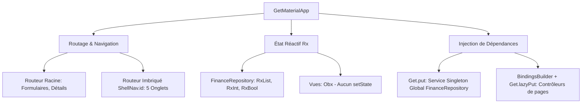
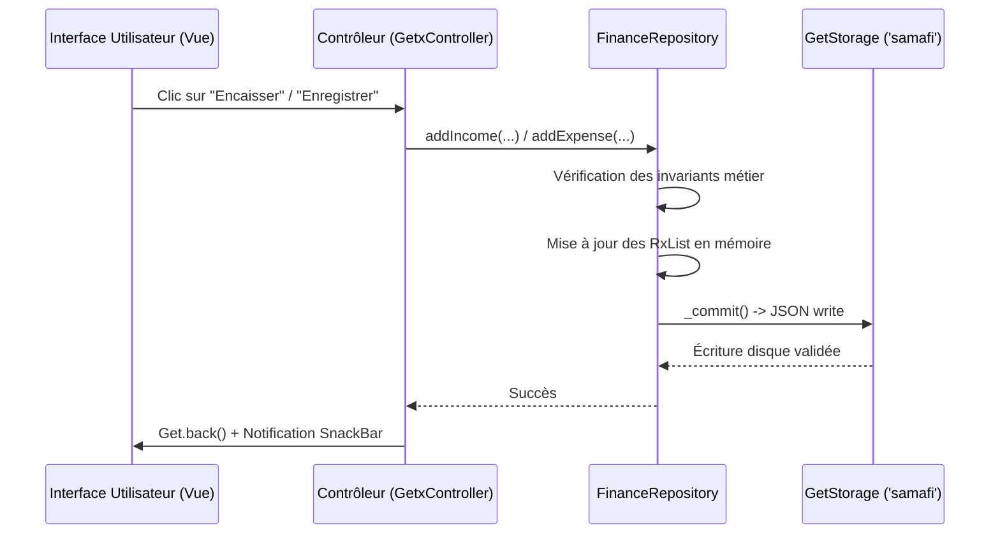

# 📚 Documentation Officielle — SamaFi Mobile

> **Version de l'application** : 1.0.0+1  
> **Devise** : Franc CFA (FCFA / XOF)  
> **Cible** : Android & Multi-plateformes (Flutter 3.38+ / Dart 3.10+)  
> **Mode de fonctionnement** : 100 % Hors-ligne (Zero Network, Zero Cloud)  

---

## 1. 🎯 Présentation et Vision du Produit

**SamaFi** est une solution mobile de gestion financière personnelle intelligente conçue sur mesure pour les réalités économiques ouest-africaines (devise **FCFA**, interface 100 % en français, gestion hors-ligne stricte).

### Piliers fondateurs :
1. **Confidentialité absolue** : Aucune donnée ne quitte le smartphone. Ni compte en ligne, ni serveur distant, ni télémétrie intrusive.
2. **Rigueur comptable & financière** :
   * Un emprunt n'est **jamais** un revenu.
   * Un remboursement de dette n'est **jamais** une dépense de consommation.
   * Tout encaissement est obligatoirement **ventilé**.
   * L'argent confié par autrui (**fonds tiers / fiducie**) est **étanche** par rapport au patrimoine personnel.
   * Tout détournement d'argent tiers crée une **créance interne** déduite du patrimoine net jusqu'à son reversement complet.

---

## 2. 🏛️ Architecture Technique

L'application repose sur le framework **Flutter** et adopte l'écosystème complet **GetX** pour ses performances et son découpage modulaire strict.

### 2.1 Les 3 Piliers GetX dans SamaFi



* **Routage et Navigation** :
  * Le **navigateur racine** pilote les écrans modaux et formulaires en plein écran (`/income`, `/expense`, `/debt-detail`, etc.).
  * Le **navigateur imbriqué (`ShellNav.id = 1`)** est logé dans la coque (`ShellView`) avec une barre de 5 onglets. Il isole l'historique de chaque onglet sans détruire la barre de navigation.
  * Gestion prédictive du bouton retour avec `PopScope` (ramène sur l'onglet Accueil avant de quitter l'app via `SystemNavigator.pop()`).
* **État Réactif** :
  * L'ensemble des données d'état vit dans des observables réactifs (`RxList<Account>`, `RxList<Transaction>`, `RxInt`, etc.).
  * Les interfaces consomment les données avec le widget `Obx(() => ...)`. Aucun `setState()` n'est utilisé dans l'application.
* **Injection de Dépendances** :
  * `FinanceRepository` est un `GetxService` persistant tout au long de la session via `Get.put(FinanceRepository())`.
  * Chaque vue charge son contrôleur à la demande via les `BindingsBuilder` déclarés dans `app_pages.dart`.

---

### 2.2 Arborescence du Projet

```text
lib/
├── main.dart                 → Initialisation (GetStorage, Intl fr_FR, GetMaterialApp)
├── core/
│   ├── constants.dart        → Énumérations, libellés français, palettes, icônes, extensions
│   ├── format.dart           → Formatage FCFA ("50 000 FCFA"), dates littérales françaises
│   └── theme.dart            → Thème Material 3 Émeraude (#059669) Clair & Sombre
├── data/
│   ├── models.dart           → Modèles de domaine (Account, Transaction, Debt, Tontine, etc.)
│   └── repository.dart       → Cerveau métier (Calculs, Piste d'audit, Persistance GetStorage)
├── routes/
│   ├── app_routes.dart       → Constantes de routes et identifiants de navigation
│   └── app_pages.dart        → Table de routage GetPage + Liaisons (Bindings)
├── shared/
│   └── widgets.dart          → Kit UI (StatCard, FormScaffold, AmountField, snackbars...)
└── modules/
    ├── splash/ & onboarding/ → Démarrage et écran de bienvenue
    ├── shell/                → Coque principale avec barre de navigation à 5 onglets
    ├── home/                 → Tableau de bord (KPIs, camembert, flux 30j, enveloppes)
    ├── accounts/             → Liste des comptes, création, édition et archivage
    ├── history/              → Historique complet des transactions filtrable par période
    ├── movements/            → Formulaires : Encaissements ventilés, Dépenses, Virements
    ├── debts/                → Emprunts, échéances, remboursements partiels ou totaux
    ├── funds/                → Fonds confiés par des tiers (dépenses objet, détournements)
    ├── tontines/             → Cercles de cotisation, membres, tours, pots
    ├── purchases/            → Cagnottes d'achats planifiés (cotisations, redirections)
    └── settings/             → Thème, profil, export CSV, données de démo, reset
```

---

## 3. 💾 Persistance et Base de Données (GetStorage)

L'application utilise **GetStorage**, un moteur NoSQL clé-valeur ultra-léger et rapide écrit en pur Dart.

### 3.1 Mécanisme de Stockage
* **Conteneur** : Boîte nommée `'samafi'`, stockée dans le bac à sable applicatif du smartphone.
* **Format** : Fichiers sérialisés en **JSON**.
* **Cycle de vie** :
  1. `GetStorage.init('samafi')` au lancement de l'application dans `lib/main.dart`.
  2. `FinanceRepository._load()` charge les collections en mémoire dans des `RxList`.
  3. À chaque écriture (ajout d'opération, modification, remboursement), la méthode `_commit()` sérialise et persiste l'état complet de manière atomique.



---

## 4. 🧮 Modèle Mathématique et Règles Métier

### 4.1 Formule du Patrimoine Net

Le patrimoine net mesure la valeur financière réelle de l'utilisateur après déduction de tous ses engagements :

$$\mathbf{Patrimoine\ Net} = \text{Actif Disponible} - \text{Créances Internes} - \text{Dettes Restantes}$$

* **Actif Disponible** : Somme des soldes de tous les comptes personnels (Caisses, Charges fixes, Épargne, Enveloppes, Projets, Tontines). Les comptes fiduciaires en sont exclus.
* **Créances Internes** : Somme de l'argent appartenant à des tiers qui a été utilisé pour un usage personnel et qui n'a pas encore été restitué.
* **Dettes Restantes** : Total du capital et des frais restant à payer sur tous les emprunts en cours.

---

### 4.2 Calcul de l'« Argent du Jour »

L'**Argent du jour** est le montant maximal journalier que l'utilisateur peut dépenser jusqu'au dernier jour du mois sans piocher dans son épargne, ses charges fixes ou ses enveloppes :

$$\mathbf{Argent\ du\ jour} = \left\lfloor \frac{\text{Portefeuille}}{\text{Jours restants dans le mois}} \right\rfloor$$

#### Variables :
* **Portefeuille** : Total des avoirs sur les comptes ayant le rôle **Caisse** (`AccountRole.wallet` : cash, Wave, OM disponible).
* **Jours restants dans le mois** :
  $$\text{Jours restants} = (\text{Dernier jour du mois} - \text{Jour actuel} + 1)$$
  *(Aujourd'hui est inclus)*.

---

### 4.3 La Ventilation Obligatoire des Encaissements

Contrairement aux applications traditionnelles qui créditent un compte global, SamaFi impose une discipline budgétaire dès l'entrée de l'argent :

$$\sum_{i=1}^{n} \text{Allocation}_i = \text{Montant total encaissé}$$

* Si $\sum \text{Allocation} < \text{Total}$ : l'application indique le reste à ventiler.
* Si $\sum \text{Allocation} > \text{Total}$ : la soumission est bloquée avec alerte d'excédent.
* Un bouton **« Tout allouer »** permet de solder automatiquement le montant restant sur la dernière enveloppe ou caisse sélectionnée.

---

### 4.4 Les Dettes Explicites

* **Un emprunt n'est pas un revenu** : Recevoir 500 000 FCFA d'emprunt augmente le passif exigible de 500 000 FCFA. Cet argent n'alimente pas les flux de revenus du mois.
* **Un remboursement n'est pas une dépense** : Rembourser une dette réduit la dette et les liquidités, mais ne fausse pas le budget de consommation courante.
* **Plafond automatique** : Un remboursement partiel ne peut jamais excéder le reste à payer ($Capital + Frais - Déjà\ remboursé$).

---

### 4.5 Étanchéité Fiduciaire et Créances Internes

L'argent confié par des tiers (**Fiducie**) possède des règles strictes :
* **Dépense Objet** : Dépense effectuée pour la mission confiée (ex. : acheter du matériel pour un proche) ➡️ Réduit le solde du fonds, aucune dette créée.
* **Détournement Tracé** : Utilisation d'une partie du fonds pour un besoin personnel ➡️ L'argent est transféré sur un compte personnel, mais une **créance interne** équivalente est créée.
* **Reversement** : Remboursement de la créance interne depuis un compte personnel vers le fonds tiers jusqu'à extinction de la dette.

---

### 4.6 Les Tontines

* Chaque cercle de tontine réunit $N$ membres avec une cotisation unitaire $C$ à fréquence définie (hebdomadaire, mensuelle).
* **Pot par tour** : $P = N \times C$.
* **Tour de l'utilisateur (« C'est mon tour ! »)** : L'utilisateur encaisse l'intégralité du pot $P$ sur le compte de son choix.
* **Encours tontine** : Les cotisations versées sont comptabilisées dans l'actif disponible car elles représentent de l'argent temporairement immobilisé récupérable à son tour.

---

## 5. 🛠️ Résolution des Incidents et Historique des Correctifs

Lors de la mise en service et des tests de l'application sur smartphone Android physique, les problèmes suivants ont été diagnostiqués et corrigés :

| Incident rencontré | Cause racine | Solution appliquée |
| :--- | :--- | :--- |
| **Erreur de typage `CardTheme`** | Évolution de Flutter Material 3 séparant `CardTheme` (Widget) et `CardThemeData` (Theme) | Remplacement de `CardTheme(...)` par `CardThemeData(...)` dans `lib/core/theme.dart`. |
| **Getters indéfinis `isBudgetable`, `colorHex`, `label`** | Import manquant du fichier de constantes dans le repository | Ajout de `import '../core/constants.dart';` dans `lib/data/repository.dart`. |
| **Paramètre `maxLength` invalide** | `maxLength` placé par erreur dans `InputDecoration` au lieu de `TextFormField` | Déplacement du paramètre sur `TextFormField` dans `lib/shared/widgets.dart`. |
| **Crash localisations `fr_FR`** | Absence des délégués de localisation officiels du SDK Flutter | Ajout de `flutter_localizations: sdk: flutter`, `intl: ^0.20.2` dans `pubspec.yaml` et configuration de `localizationsDelegates` dans `lib/main.dart`. |
| **Crash route `"/"` du `Navigator`** | Navigateur imbriqué de la barre d'onglets créé sans `onGenerateRoute` ni `initialRoute` | Implémentation d'un générateur de routes `GetPageRoute` pour les 5 onglets dans `lib/modules/shell/shell_view.dart`. |
| **Formulaires non fermés + Aucune notif** | `Get.snackbar` mettait `isSnackbarOpen = true`, causant `Get.back()` à fermer la snackbar au lieu de fermer la page | Migration vers `ScaffoldMessenger.of(context).showSnackBar` et inversion de l'ordre (`Get.back()` puis snackbar). |

---

## 6. 🚀 Guide d'Exploitation et Commandes

### Lancer l'application en mode développement
```powershell
flutter run -d byivtkbeyhugifyp
```

### Exécuter les tests unitaires
```powershell
flutter test
```

### Vérification de la qualité du code
```powershell
flutter analyze
```

### Générer les installables (APKs)
* **APK Débogage** (rapide avec logs étendus) :
  ```powershell
  flutter build apk --debug
  # Fichier généré : build\app\outputs\flutter-apk\app-debug.apk
  ```
* **APK Production / Release** (optimisé avec R8, code shrinké et tree-shaking des icônes) :
  ```powershell
  flutter build apk --release
  # Fichier généré : build\app\outputs\flutter-apk\app-release.apk (50.5 Mo)
  ```
